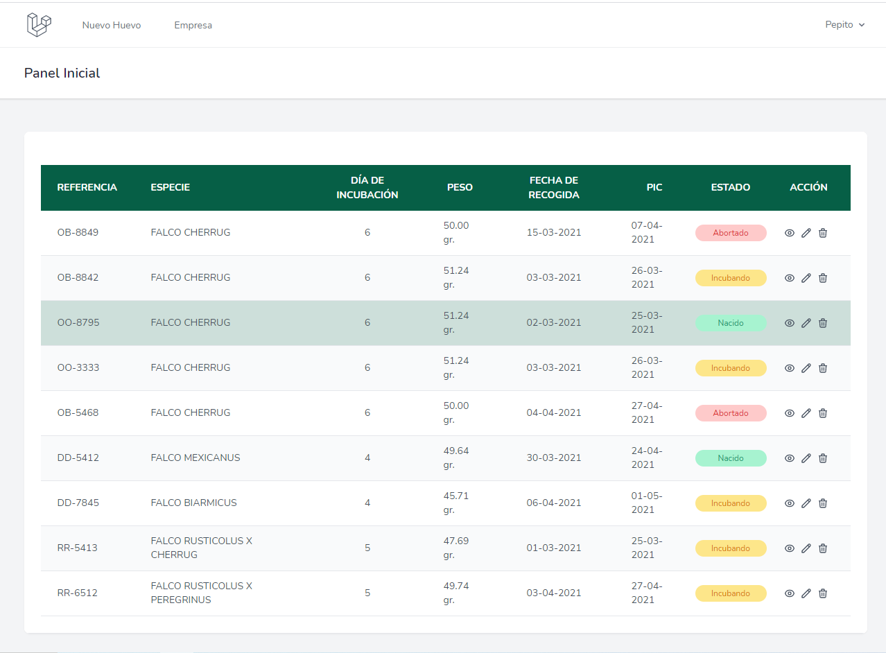
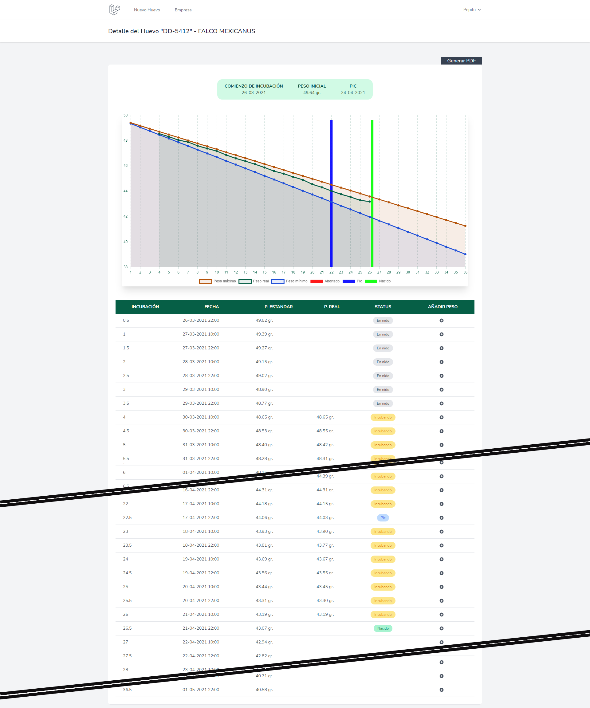

## About this project
This project has been made to monitor the incubation status of the eggs of some birds.
In this repository, the formula for calculate it has been changed, it's not real. Some percentages have been changed too.

## About its installation
This project has been made with Laravel framework.
For install it, run migrations with seeds. 
Once installed create your own user.

## Some images of this project

    

    

